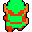
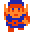

####Delainey Ackerman
####Intro to Game Programming
####Assignment 1: Basic 2D game mod from example_invaders
####November 2016

#####[Link for demo video] (https://youtu.be/ejbD38uXy2k)

######Game Description:
Fight your way through multiple levels, defending your territory from the copycat Link Invaders.  
Take cover behind walls, but look out! They don't last forever. 

######Major Additions:
* Define Player and Enemy Playing Spaces
  * I used a fifth, invisible wall as a border sprite between player and invader game areas. The invaders can   
  move in roughly the upper two thirds of the game window. Once the lowermost invader reaches the dividing     
  border, all invaders begin to move back upscreen. After the top most invader reaches the top border all    
  invaders will switch to once again move downscreen towards the player.
  * This is implemented similarly to the invader velocity determining if the invaders are moving left to right 
  (positive) direction across the screen, or right to left (negative) direction. In *simulate()* I perform  
  a check after moving the invaders to see if any invader sprite collided with the top or dividing border  
  in addition to the exisisting check to determine if the invaders hit a side border and need to change 
  direction. 
  
  ``` cpp
  float invader_direction;
  ...
  // Middle Divider and Top
  sprite &borderTop = sprites[first_border_sprite + (invader_direction < 0 ? 4 : 1)];
  if (invaders_collide(borderTop)) {
    invader_direction = -invader_direction;
    move_invaders(invader_velocity, invader_direction); 
  }
  ```
 
*  Add Wall Sprites That Take Multiple Damage Hits Before Destruction
  * I added an different group of sprites, called walls, to the enumerator in *invaderers_app*. These walls  
  are a type of sprite that can take 3 hits of damage, visually deteriorating after each hit, before being  
  destroyed. Beyond setting up textures, collision detection, and initializing the wall sprites, the main  
  implementation required for the wall functionality was adapting the *Sprite* class to keep track of  
  the number of lives remaining and swap out the appropriate textures after each damage hit.
  * Wall with 3 damage hits left 
  * 
  * Wall with 2 damage hits left
  * 
  * Wall with 1 damage hit left
  * 
  * I implemented a second constructor to the *Sprite* class to allow sprites to have multiple lives. The original constructor was changed to default number of lives to 1. With this implimentation any sprite could be initialized with multiple lives (or damage hit points) which would be useful in extending this code to include boss level enemies or additional strong and weak cover sprites. I added simple getter and setter functions so that life counter is a private member variable and the upkeep of each sprite's lives is not directly changed by any outside class. I also switched the player (or ship) sprite over to use this second constructor to eleminate the use of one of the sundry counters initialized in *app_init()* to track the number of player lives left used to determine the overal game state.  
  
  ``` cpp
  // Second constructor used for player, walls, and other sprites with multiple lives
  void init(int _texture, float x, float y, float w, float h, int life) {
    modelToWorld.loadIdentity();
    modelToWorld.translate(x, y, 0);
    halfWidth = w * 0.5f;
    halfHeight = h * 0.5f;
    texture = _texture;
    enabled = true;
    lives = life;
  }
  ```
  * In order to change the texture after each time the wall is hit I added one more function to the  
  *Sprite* class.
  ``` cpp
  // update sprite texture with new image
    void change_texture(GLuint _texture) {
      texture = _texture;
    }
  ```
  * This way when a collision with a projectile and a wall sprite is triggered and the wall is not  
  completely destroyed, the game within the *invader_app* class can build a path file string to the
  wall texture with one fewer lives remaining and pass that texture in to the wall sprite to update
  the graphic.
  ``` cpp
  // Damage wall
  if (currLives > 1) {
    wall.life_lost();
    std::string wallTextureFile = "assets/invaderers/wall" +  std::to_string(--currLives) + ".gif";
    // example std::string from StackOverflow goo.gl/6ntDg2
    newTexture = resource_dict::get_texture_handle(GL_RGBA, wallTextureFile.c_str());
    wall.change_texture(newTexture);
  }
  ```
  
* Multiple Levels Generated by Reading CSV File
  * Adapted from Andy Thomason's [read a CSV example] (https://github.com/andy-thomason/read_a_csv_file/blob/master/main.cpp) I wrote a simple function to open a CSV file, step  
  through each line storing information for the initial positions of each invader, wall, and the player in  
  the current level. 

* Game States: Pause, Restart, Next Level

* Uniform Shader: tint color of player texture based on number of lives left

######Minor Modifications:
* Add Additional Key Press Functionality
  * Modify [app_common.h] (https://github.com/dack91/octet/blob/master/octet/src/platform/app_common.h) by adding more ascii 
  keys used to navigate game states like Pause, Restart, and Next Level.
  
* Vertical Player Movement
  * within the bounds of the player area difined by the fifth divider border wall discussed earlier
  
* Self Defense: Destroy bombs with missiles
  * I modified *move_missiles()* to iterate through bomb sprites and check for colisions in addition to the  
  existing checks if the missile collided with any active invader sprites or any of the damagable walls  
  implemented and described earlier. This modification finilizes the three methods the player can use to  
  avoid being hit by invader bombs: take cover behind temporary walls, dodge the attack with four directional  
  movement, and shoot a missile at the bomb to destroy both projectiles.
  * I also initiated bombs closer to the player in order to fix bug which allowed a player to hide underneath    
  a wall and shoot through it without damaging the wall because the missile was initiated too far in front  
  of the player on the other side of the wall. 
  ``` cpp
  // Initialize missile closer to ship so it can't shoot through walls
  sprites[first_missile_sprite+i].set_relative(sprites[ship_sprite], 0, 0.15f);
  ```

* Changed Sprite Source Images and Game Colors   
  * Player
  * 
  * Invader
  * 


